<div class="MCWHeader1">
Cognitive services and deep learning
</div>

<div class="MCWHeader2">
Hands-on lab step-by-step
</div>

<div class="MCWHeader3">
December 2018
</div>

Information in this document, including URL and other Internet Web site references, is subject to change without notice. Unless otherwise noted, the example companies, organizations, products, domain names, e-mail addresses, logos, people, places, and events depicted herein are fictitious, and no association with any real company, organization, product, domain name, e-mail address, logo, person, place or event is intended or should be inferred. Complying with all applicable copyright laws is the responsibility of the user. Without limiting the rights under copyright, no part of this document may be reproduced, stored in or introduced into a retrieval system, or transmitted in any form or by any means (electronic, mechanical, photocopying, recording, or otherwise), or for any purpose, without the express written permission of Microsoft Corporation.

Microsoft may have patents, patent applications, trademarks, copyrights, or other intellectual property rights covering subject matter in this document. Except as expressly provided in any written license agreement from Microsoft, the furnishing of this document does not give you any license to these patents, trademarks, copyrights, or other intellectual property.

The names of manufacturers, products, or URLs are provided for informational purposes only, and Microsoft makes no representations and warranties, either expressed, implied, or statutory, regarding these manufacturers or the use of the products with any Microsoft technologies. The inclusion of a manufacturer or product does not imply endorsement of Microsoft of the manufacturer or product. Links may be provided to third-party sites. Such sites are not under the control of Microsoft and Microsoft is not responsible for the contents of any linked site or any link contained in a linked site, or any changes or updates to such sites. Microsoft is not responsible for webcasting or any other form of transmission received from any linked site. Microsoft is providing these links to you only as a convenience, and the inclusion of any link does not imply endorsement of Microsoft of the site or the products contained therein.

©  2018 Microsoft Corporation. All rights reserved.

Microsoft and the trademarks listed at <https://www.microsoft.com/en-us/legal/intellectualproperty/Trademarks/Usage/General.aspx> are trademarks of the Microsoft group of companies. All other trademarks are the property of their respective owners.

# Cognitive services and deep learning hands-on lab step-by-step

## Contents

- [Abstract and learning objectives](#abstract-and-learning-objectives)
- [Overview](#overview)
- [Solution architecture](#solution-architecture)
- [Requirements](#requirements)
- [Exercise 1: Setup Azure Databricks Workspace](#exercise-1-setup-azure-databricks-workspace)
  - [Task 1: Provision Azure Databricks service](#task-1-provision-azure-databricks-service)
  - [Task 2: Upload the databricks notebook archive](#task-2-upload-the-databricks-notebook-archive)
  - [Task 3: Provision a cluster](#task-3-provision-a-cluster)
- [Exercise 2: Create and Deploy an Unsupervised Model](#exercise-2-create-and-deploy-an-unsupervised-model)
  - [Task 1: Install libraries](#task-1-install-libraries)
  - [Task 2: Read thru and execute the Summarization notebook](#task-2-read-thru-and-execute-the-summarization-notebook)
  - [Task 3: Provision the Azure Machine Learning Workspace and Create the Summarization service](#task-3-provision-the-azure-machine-learning-workspace-and-create-the-summarization-service)
- [Exercise 3: Create and Deploy a TensorFlow Model](#exercise-3-create-and-deploy-a-tensorflow-model)
  - [Task 1: Create a simple TensorFlow based model](#task-1-create-a-simple-tensorflow-based-model)
  - [Task 2: Deploy the TensorFlow model](#task-2-deploy-the-tensorflow-model)
- [Exercise 4: Completing the solution](#exercise-4-completing-the-solution)
  - [Task 1: Deploy the Computer Vision API](#task-1-deploy-the-computer-vision-api)
  - [Task 2: Deploy the Text Analytics API](#task-2-deploy-the-text-analytics-api)
  - [Task 3: Completing the solution](#task-3-completing-the-solution)
- [After the hands-on lab](#after-the-hands-on-lab)
  - [Task 1: Clean up lab resources](#task-1-clean-up-lab-resources)

## Abstract and learning objectives

In this hands-on lab, you will implement a solution which combines both pre-built artificial intelligence (AI) in the form of various Cognitive Services, with custom AI in the form of services built and deployed with Azure Machine Learning service. You will learn to create intelligent solutions atop unstructured text data by designing and implementing a text analytics pipeline. You will discover how to build a binary classifier using a simple neural network that can be used to classify the textual data, as well as how to deploy multiple kinds of predictive services using Azure Machine Learning and learn to integrate with the Computer Vision API and the Text Analytics API from Cognitive Services.

At the end of this hands-on lab, you will be better able to implement solutions leveraging Azure Machine Learning service and Cognitive Services.

## Overview

In this workshop, you will help Contoso Ltd. build a proof of concept that shows how they can build a solution that amplifies the claims processing capabilities of their agents.

## Solution architecture

The high-level architecture of the solution is illustrated in the diagram. The lab is performed within the context of a notebook running within Azure Databricks. Various notebooks are built to test the integration with the Cognitive Services listed, to train custom ML services, and to integrate the results in a simple user interface that shows the result of processing the claim with all of the AI services involved.


## Requirements

1.  Microsoft Azure subscription must be pay-as-you-go or MSDN

    a.  Trial subscriptions will not work. You will run into issues with Azure resource quota limits.

    b.  Subscriptions with access limited to a single resource group will not work. You will need the ability to deploy multiple resource groups.

## Exercise 1: Setup Azure Databricks Workspace

Duration: 20 minutes

In this exercise, you will setup your Azure Databricks account and Workspace.

### Task 1: Provision Azure Databricks service

1.  Navigate to the Azure Portal.

2.  Select **Create a resource**.

    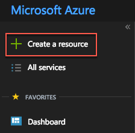

3.  In the search box, enter **Azure Databricks** and then select the matching entry that appears with the same name.

    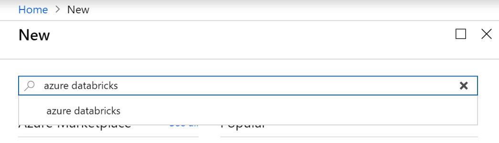

4.  On the **Azure Databricks** blade, select **Create**. 

5.  On the **Azure Databricks Service**, enter the following and then select **Create**:

    a.  Workspace Name: enter `claims-workspace`.

    b.  Subscription: choose your Azure subscription. 

    c. Resource roup: choose Create new and then specify the name `mcwailab`.

    d. Location: choose a location near you.

    e. Pricing Tier: select `Premium`.

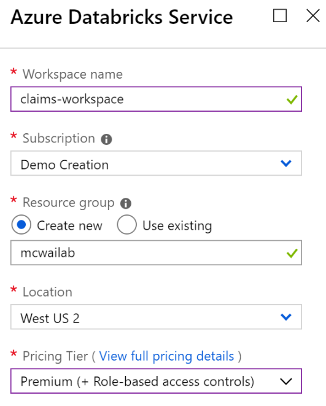

6.  When the deployment completes, navigate to your deployed Azure Databricks service and select **Launch Workspace**. If prompted, sign in using the same credentials you used to access the Azure Portal.

    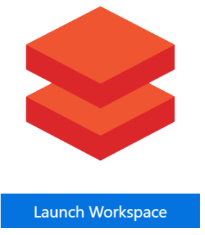

### Task 2: Upload the Databricks notebook archive

1. Within the Workspace, using the command bar on the left, select Workspace, Users and select your username (the entry with house icon).

2. In the blade that appears, select the downwards pointing chevron next to your name, and select Import.

3. On the Import Notebooks dialog, select URL and paste in the following URL:
    ```
    https://github.com/Microsoft/MCW-Cognitive-services-and-deep-learning/blob/master/Hands-on%20lab/images/Hands-onlabstep-bystep-CognitiveServicesanddeeplearningimages/notebooks/AI-Lab.dbc?raw=true
    ```

5. Select Import.

6. A folder named after the archive should appear. Select that folder.

7. The folder will contain one or more notebooks. These are the notebooks you will use in completing this lab.


### Task 3: Provision a cluster

1. Within the Workspace, from the menu on the left, select Clusters.

2. Select **+ Create Cluster**.

3. On the New Cluster page, provide the following:

    a. Cluster Name: `ailab`

    b. Cluster Mode: `Standard`

    c. Databricks Runtime Version: `4.3 (includes Apache Spark 2.3.1, Scala 2.11)`

    d. Python Version: `3`

    e. Driver Type: `Same as worker`

    f. Worker Type: `Standard_F4s`

    g. Enable autoscaling: `Unchecked`

    h: Workers: `2`

    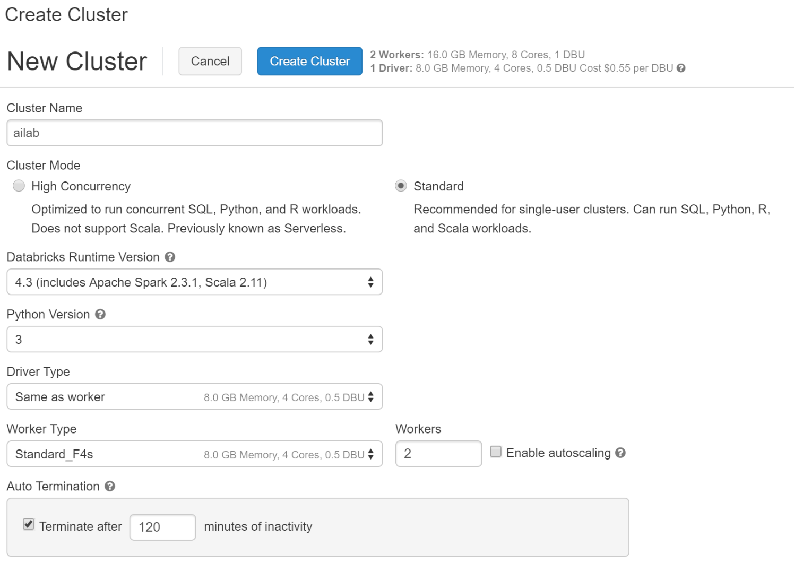

4. Select **Create Cluster**. This will take about 5 minutes to provision your cluster. The cluster will show a State of "Ready" when the cluster is available for use.


## Exercise 2: Create and Deploy an Unsupervised Model

Duration: 60 minutes

In this exercise, you will create and deploy a web service that uses a pre-trained model to summarize long paragraphs of text. 

### Task 1: Install libraries

The notebook you will run depends on certain Python libraries like nltk and gensim that will need to be installed in your cluster. The following steps walk you thru adding these dependencies. 

1. From the left-hand menu in your Workspace, select **Clusters**.

    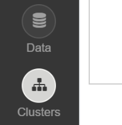

2. In the list of clusters, select your cluster.

    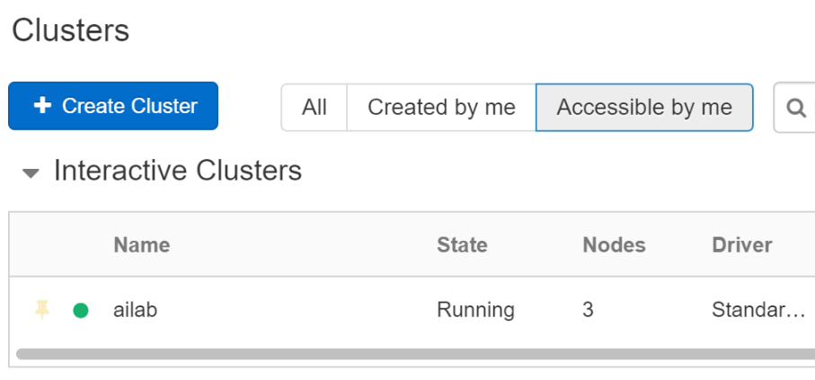

3. Select the Libraries link and then select Attach New. 

    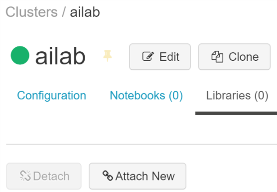

>**Note**: There are interface updates being deployed, if you do not see the Attach New button, instead go to the Azure Databricks menu option in your Workspace (the very top option on the left) and select Import Library. Then select a source of **Upload Python Egg or PyPi** and then provide the Package name specified in the following steps in the PyPi Name text box. Then in the Status on running clusters list, check the checkbox Attach that is listed to the left of your cluster's name to install the library on your cluster. When successful the Status should read `Attached`.

4. In the Library Source, select **PyPi** and in the Package text box type `nltk` and select Create.

    

5. An entry for nltk will appear in the list with a status of installing followed by installed. Select **Attach New** again. As before, select PyPi but this time for package specify `gensim`.

### Task 2: Read thru and execute the Summarization notebook

1. Within the Workspace, select the Workspace item in the menu and navigate to the folder where you uploaded the Databricks Archive (which should be [your-name/AI-lab]), and select the notebook called `01 Summarize`. This will open the notebook so you can read and execute the code it contains.

2. Read the instructions at the top of the notebook, and execute the cells as instructed. Remember you can use `SHIFT + ENTER` to execute the currently selected cell, and if you do not have a cluster attached, you will be prompted to attach to the cluster you recently deployed.


### Task 3: Provision the Azure Machine Learning Workspace and Create the Summarization service

1. Within the Workspace, select the Workspace item in the menu and navigate to the folder where you uploaded the Databricks Archive (which should be [your-name/AI-lab]), and select the notebook called `02 Deploy Summarizer Web Service`. This will open the notebook so you can read and execute the code it contains.

2. Read the instructions at the top of the notebook, and execute the cells as instructed. Remember you can use `SHIFT + ENTER` to execute the currently selected cell, and if you do not have a cluster attached, you will be prompted to attach to the cluster you recently deployed. **Note that you will be directed to attach the `azureml-sdk[databricks]` library in the notebook using the same procedure you followed in Task 1.**


## Exercise 3: Create and Deploy a TensorFlow Model

Duration: 60 minutes

In this exercise, you will use TensorFlow to construct and train a simple deep neural network classification model that will classify claim text as belonging to a home insurance claim or an automobile claim. You will then deploy this trained model as a web service.

### Task 1: Create a simple TensorFlow based model

1. Within the Workspace, select the Workspace item in the menu and navigate to the folder where you uploaded the Databricks Archive (which should be [your-name/AI-lab]), and select the notebook called `03 Claim Classification`. This will open the notebook so you can read and execute the code it contains.

2. Read the instructions at the top of the notebook, and execute the cells as instructed. Remember you can use `SHIFT + ENTER` to execute the currently selected cell, and if you do not have a cluster attached, you will be prompted to attach to the cluster you recently deployed. 


### Task 2: Deploy the TensorFlow model

1. Within the Workspace, select the Workspace item in the menu and navigate to the folder where you uploaded the Databricks Archive (which should be [your-name/AI-lab]), and select the notebook called `04 Deploy Classifier Web Service`. This will open the notebook so you can read and execute the code it contains.

2. Read the instructions at the top of the notebook, and execute the cells as instructed. Remember you can use `SHIFT + ENTER` to execute the currently selected cell, and if you do not have a cluster attached, you will be prompted to attach to the cluster you recently deployed. 


## Exercise 4: Completing the solution

Duration: 45 minutes

In this exercise, you will perform the final integration with the Computer Vision API and the Text Analytics API along with the Azure Machine Learning service you previously deployed, to deliver the completed proof of concept solution.

### Task 1: Deploy the Computer Vision API

1.  Navigate to the Azure Portal in your browser.

2.  Select **Create a resource**.

3.  Select **AI + Machine Learning** and then **Computer Vision**.\
    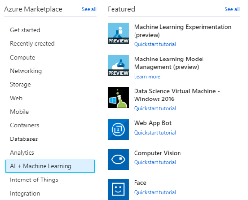

4.  On the **Create** blade, provide the following:

    a.  **Name:** provide a unique name for this instance.

    b.  **Subscription:** select your Azure subscription.

    c.  **Location**: select a location nearest your other deployed services.

    d.  **Pricing tier**: select S1.

    e.  **Resource group**: select the existing mcwailab resource group.
    
       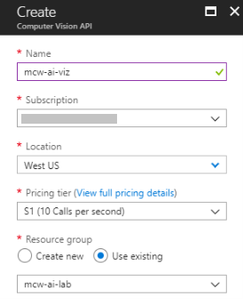

5.  Select **Create**.

6.  When the notification appears that the deployment succeeded, select **Go to resource**.

    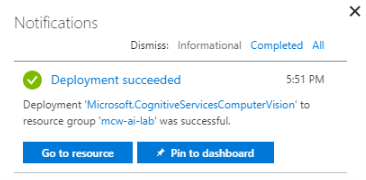

7.  Select **Keys** and then copy the value of Key 1 into notepad or something similar as you will need this value later in the lab.

    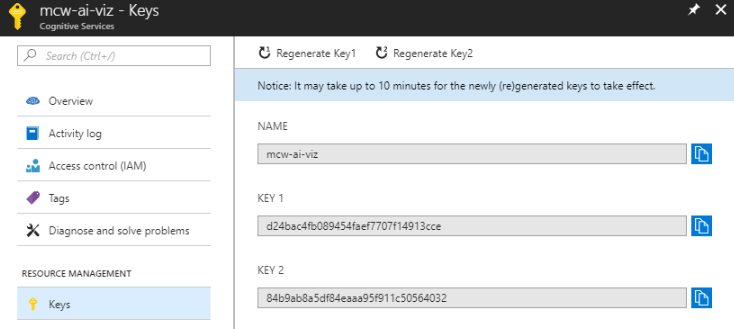

8.  Select **Overview** and copy the value of Endpoint from the Essentials panel. Store this value in notepad or something similar as you will need this value later in the lab.

    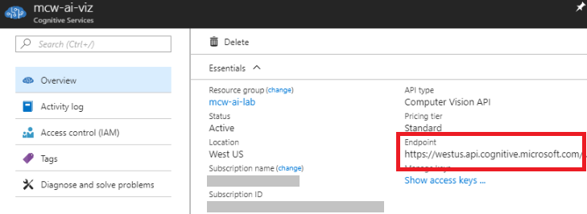

### Task 2: Deploy the Text Analytics API

1.  Navigate to the Azure Portal in your browser.

2.  Select **Create a resource**.

3.  Select **AI + Machine Learning** and then **Text Analytics**.

    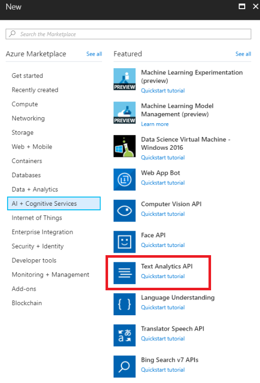

4.  On the **Create** blade, provide the following:

    a.  **Name**: provide a unique name for this instance.

    b.  **Subscription**: select your Azure subscription.

    c.  **Location**: select a location nearest your other deployed services.

    d.  **Pricing tier**: select S0.

    e.  **Resource group**: select the existing mcw-ai-lab resource group.
    
       

5.  Select **Create**.

6.  When the notification appears that the deployment succeeded, select **Go to resource**.

    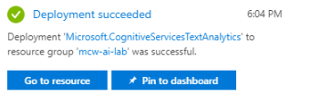

7.  Select **Keys**, and then copy the value of Key 1 into notepad or something similar as you will need this value later in the lab.

    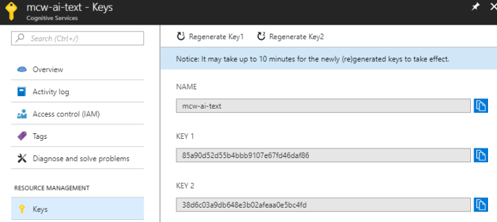

8.  Select **Overview** and copy the value of Endpoint from the Essentials panel. Store this value in notepad or something similar as you will need this value later in the lab.

    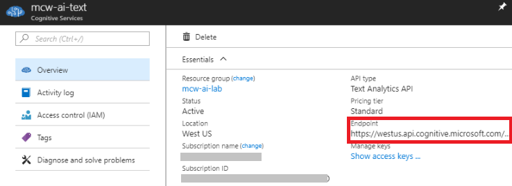

### Task 3: Completing the solution

1. Return to your Azure Databricks Workspace. Select the Workspace item in the menu and navigate to the folder where you uploaded the Databricks Archive (which should be [your-name/AI-lab]), and select the notebook called `05 Cognitive Services`. Follow the steps within the notebook to complete the lab and view the result of combining Cognitive Services with your Azure Machine Learning Services.

## After the hands-on lab

Duration: 5 minutes

To avoid unexpected charges, it is recommended that you clean up all of your lab resources when you complete the lab.

### Task 1: Clean up lab resources

1.  Navigate to the Azure Portal and locate the `mcwailab` Resource Group you created for this lab.

2.  Select **Delete resource group** from the command bar.

    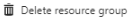

3.  In the confirmation dialog that appears, enter the name of the resource group and select **Delete**.

4.  Wait for the confirmation that the Resource Group has been successfully deleted. If you don't wait, and the delete fails for some reason, you may be left with resources running that were not expected. You can monitor using the Notifications dialog, which is accessible from the Alarm icon.

    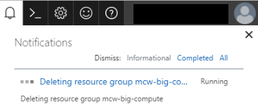

5.  When the Notification indicates success, the cleanup is complete.

    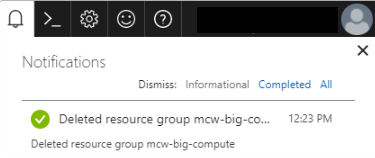

You should follow all steps provided *after* attending the Hands-on lab.
