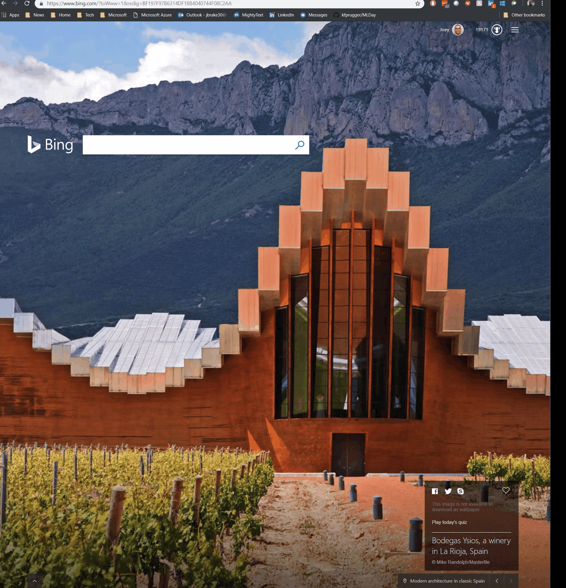

# Please install these pre-requisites when you login

These steps will get your started with a fresh start. If at all possible, please try to have these pre-requisites complete before the lab.


## Please execute the following scripts inside your Azure portal using the BASH [Azure Cloud Shell](https://docs.microsoft.com/en-us/azure/cloud-shell/overview)


## **Tip: Copy and paste these blocks of code together inside the Azure Cloud Shell (see above graphic)**
```azurecli
read -p "Enter Your Student Number: " stunum # This is your Resource Group Number listed at portal.azure.com --> Resource Groups link
```
```
echo "Your Student Number is" $stunum
stoacct=ml2019stu$stunum
stocont=hadooplabs
sturg="Student$stunum"
curl -o weblogs.csv https://raw.githubusercontent.com/Microsoft/code-challenges/master/Labs/Azure%20HDInsight/HiveLab/Data/hadooplabs/Lab1/weblogs.csv
````
```
az storage account create --resource-group $sturg --location eastus --name $stoacct --sku Standard_LRS 
```
```
az storage container create  --name hadooplabs --account-name $stoacct
az storage container create  --name $stoacct --account-name $stoacct

```
```
stokey=$(az storage account keys list --account-name $stoacct --query [0].value | tr -d '"')
```
```
azcopy --source weblogs.csv --destination https://$stoacct.blob.core.windows.net/$stoacct/hadooplabs/Lab1/weblogs.csv --dest-key $stokey
```
```
az group deployment create --name HDIdeploy --resource-group $sturg --template-uri "https://raw.githubusercontent.com/kfprugger/MLDay/master/HDInsightProvision/template.json" --parameters "clusterName=ml2019stu$stunum" 'clusterType=hadoop' 'clusterLoginUserName=azure' 'sshUserName=azure' "storageAccount=$stoacct" 
```
# Optional tools to aid in Machine Learning & Big Data Cloud Development

## Install Command-Line Tools and Integrated Development Environment (IDE)

1. Install the cross-platform [Azure Command-Line Interface (CLI)](http://aka.ms/installCLI)  

	*Optional: IF you don't want to use the native web-based Azure Cloud Shell and want to use your own computer instead*
2. Install the cross-platform [Visual Studio Code](https://code.visualstudio.com/Download) 

	*Optional: It makes it easier if you have this installed as your .JSON file editor as it marks all sorts of files cleanly and has great GitHub integration*

3. Optional: Install GitHub to [Download ML Day Materials](https://desktop.github.com) </i>
